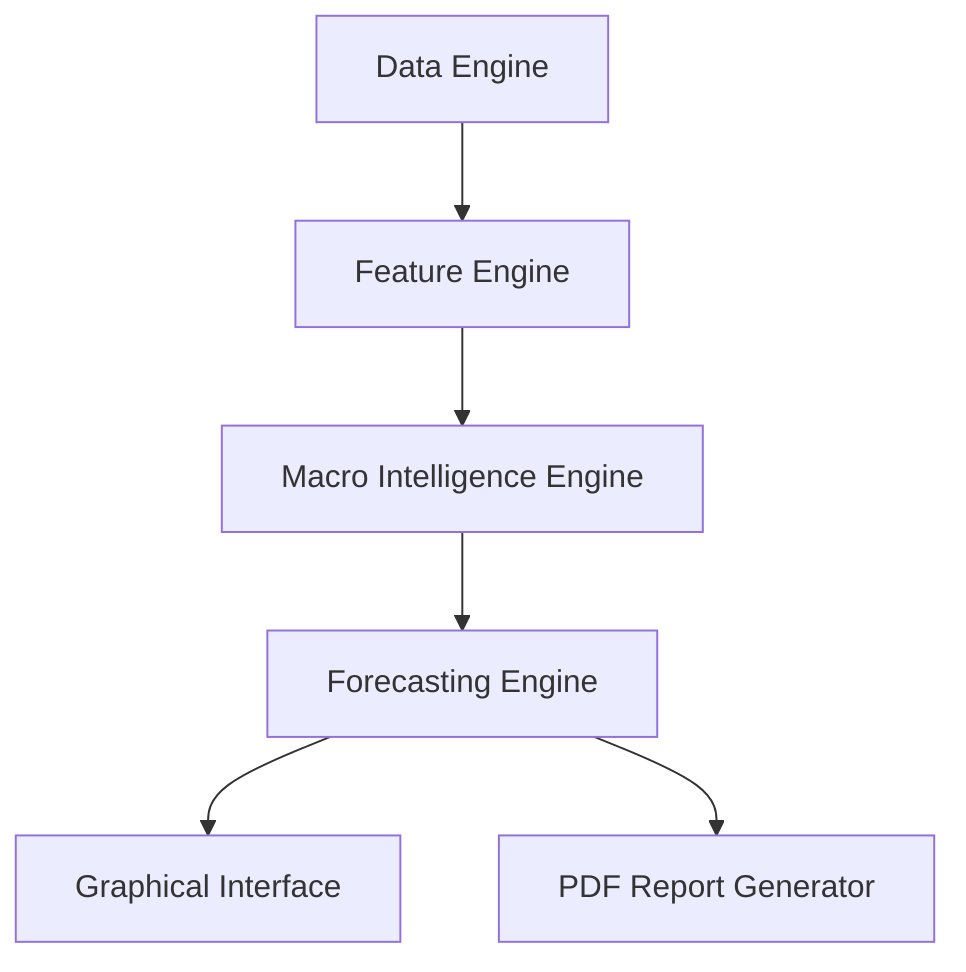

# Macro Intelligence Platform


The **Macro Intelligence Platform** is an academically-validated quantitative forecasting and reporting engine. It traces the business cycle using Composite Leading Indicators (CLI) and macroeconomic variables, providing scenario analysis and conviction scoring for the next 6-month horizon.

---

## 🌟 Key Features

- **Business Cycle Tracing**: Maps the economy across 4 classical cycle phases (Expansion, Slowdown, Contraction, Recovery) using OECD CLI data.
- **Three-Signal Consensus Forecasting**: Blends three distinct signals for robust forecasting:
  1. CLI Momentum (Z-Score)
  2. Multivariate Historical Analogues
  3. Macro Driver Trajectories (e.g., Real Policy Rate, IIP, CPI)
- **Probabilistic Calibration**: Maps historical hit-rates to conviction tiers, providing empirically validated probabilities for Bull, Base, and Bear scenarios.
- **Automated Report Generation**: Exports comprehensive, presentation-ready PDF reports with dynamic narrative generation and chart layouts.
- **Look-Ahead Bias Elimination**: The core engine is rigorously backtested to ensure no forward-leakage of data during historical analogue construction.

---

## 🏛️ Architecture

The system is highly modularized, strictly separating data ingestion, feature engineering, and UI:



- `data/`: Orchestrates fetching from providers (FRED, Yahoo Finance) with smart local caching.
- `features/`: Computes transformations (Z-Scores, YoY variations, Real Policy Rates).
- `analytics/`: Houses the quantitative models (`MacroIntelligenceEngine` and `ForecastingEngine`).
- `research/`: Constructs automated narratives, layouts, and PDF output via ReportLab.
- `ui/`: Lightweight Tkinter interface for launching exports and viewing live data.

---

## 🚀 Installation & Usage

### Prerequisites
- Python 3.9+
- Windows (for the `.bat` launcher) or macOS/Linux.

### Setup
1. Clone the repository:
   ```bash
   git clone https://github.com/VIJNESH200/macro_intelligence_platform.git
   cd macro_intelligence_platform
   ```
2. Install dependencies:
   ```bash
   pip install -r requirements.txt
   ```

### Running the Application

**On Windows:**
Simply double-click `run_platform.bat`. This script will ensure dependencies are installed and launch the GUI.

**Via Command Line (All OS):**
```bash
python main.py
```

### Exporting Reports
1. Let the platform fetch and process the macro series.
2. Click the **"Export PDF"** button at the bottom of the window.
3. The generated PDF will be saved to the `exports/` folder and automatically opened.

---

## 📊 Validation & Rigor

The forecasting logic in `ForecastingEngine` has been backtested over a rolling 200+ month out-of-sample window. It demonstrates consistent outperformance against standard baseline models (Persistence, Markov Chain transitions, and single-signal models).

Run the validation suite locally:
```bash
python tests/backtest_benchmarks.py
```

---

## 🛣️ Roadmap
- [ ] Add support for the US and Eurozone CLI tracking.
- [ ] Incorporate Machine Learning classifiers (XGBoost/Random Forest) alongside the consensus model.
- [ ] Expand the market context panel to include commodities and emerging market FX pairs.
- [ ] Transition from Tkinter to a web-based dashboard (e.g., Streamlit or Dash).

---

## ⚠️ Limitations
- **Data Availability**: Relies heavily on the OECD and FRED publishing schedules. Series are forward-filled to handle publication lags.
- **Scope**: Currently tuned primarily for the Indian macro environment (OECD India CLI, RBI repo rates).

---

## 🤝 Contributing
Contributions are welcome! Please read our [Contributing Guidelines](CONTRIBUTING.md) and submit Pull Requests or Issues.

---

## 📄 License
This project is licensed under the [MIT License](LICENSE).

---

## 🙏 Acknowledgements
- **FRED**: Data sourced from the Federal Reserve Bank of St. Louis.
- **OECD**: Composite Leading Indicator methodologies and datasets.
- **RBI**: Base data proxies for India's policy rates and inflation expectations.
