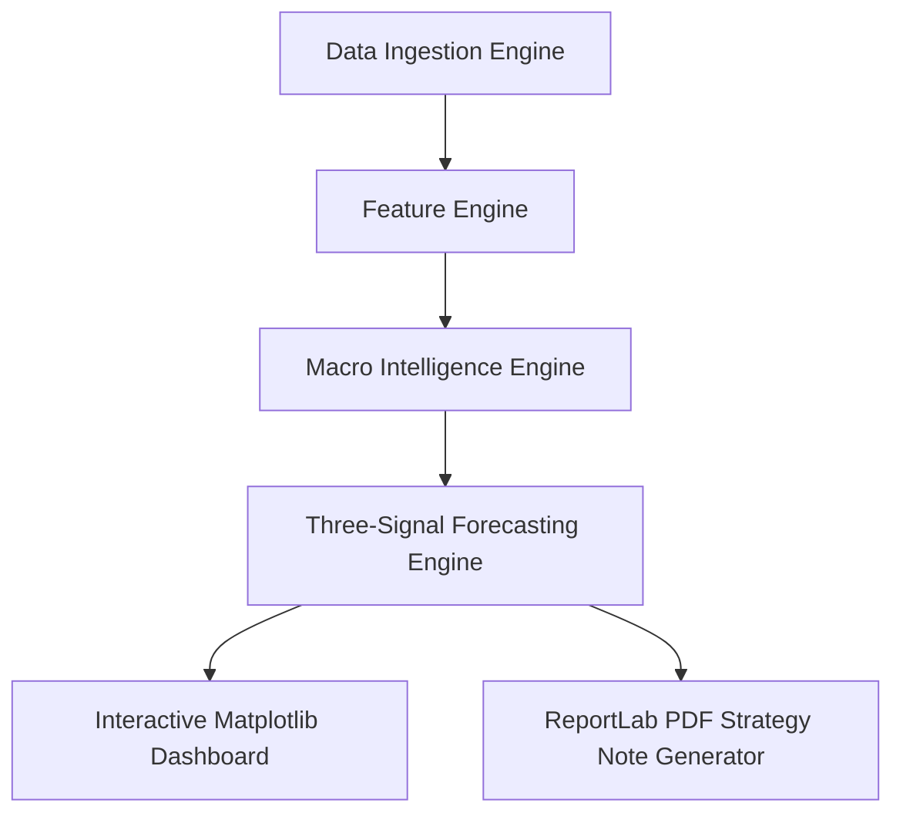
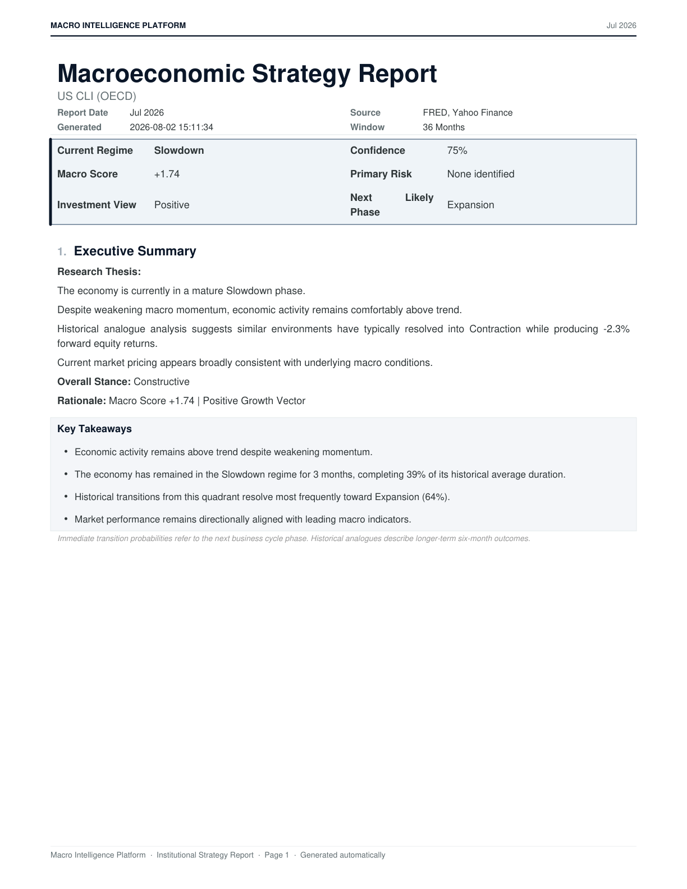
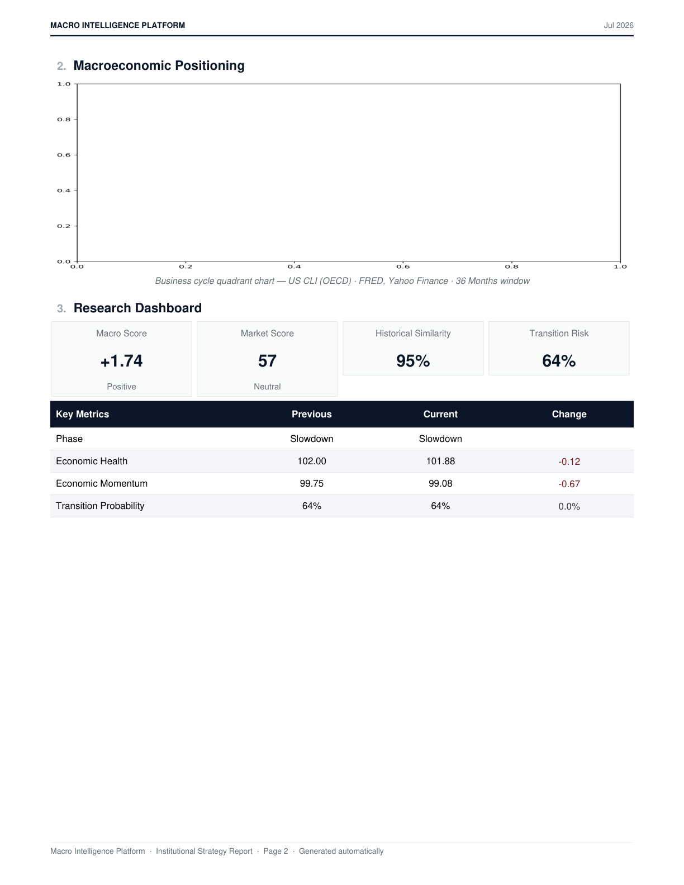

# Macro Intelligence Platform

[](LICENSE)
[](https://www.python.org/downloads/)
[](https://github.com/VIJNESH200/macro_intelligence_platform/actions/workflows/ci.yml)
[](https://github.com/VIJNESH200/macro_intelligence_platform)
[](https://github.com/VIJNESH200/macro_intelligence_platform)

An academically-validated, open-source **quantitative business cycle forecasting engine** and interactive macroeconomic intelligence dashboard. It traces economic phase shifts across 4 classical regimes (*Expansion, Slowdown, Contraction, Recovery*) and projects 3M/6M/9M forward trajectories using a 3-signal consensus framework.


---

## 📌 Table of Contents
- [🌟 Highlights](#-highlights)
- [📊 Backtest & Empirical Validation](#-backtest--empirical-validation)
- [🏛️ System Architecture](#️-system-architecture)
- [🚀 Quick Start](#-quick-start)
- [🌐 Open Data Pipeline](#-open-data-pipeline)
- [📄 Automated Strategy Note Export](#-automated-strategy-note-export)
- [🤝 Contributing & License](#-contributing--license)

---

## 🌟 Highlights

- **4-Phase Business Cycle Tracing**: Maps macro health ($X$) and momentum ($Y$) using rolling Z-score transformations of Composite Leading Indicators (OECD CLI) and economic drivers.
- **Three-Signal Consensus Forecasting**: Eliminates single-model bias by blending three orthogonal signals:
  1. **CLI Momentum Extrapolation** (with exponential decay pull toward long-term trend)
  2. **Multivariate Historical Analogues** (Euclidean distance matching across past cycle footprints)
  3. **Macro Driver Directional Bias** (Real Policy Rate, Core Industries, CPI, Yield Spreads)
- **100% Open Data & Reproducible**: Fully automated pipeline using public sources (FRED, DPIIT, Yahoo Finance, RBI), replacing paywalled/proprietary PMI data with the official Government of India **Index of Eight Core Industries (ICI)**.
- **Automated Institutional Strategy Notes**: Exports publication-ready PDF research briefs featuring Markov transition matrices, scenario distributions (Bull/Base/Bear), and narrative synthesis.

---

## 📊 Backtest & Empirical Validation

Evaluated across a rolling **200+ month out-of-sample historical window** (Jan 2007 – Present):

| Model / Baseline | 3M Quadrant Accuracy | 6M Quadrant Accuracy | Health (X) MAE | Momentum (Y) MAE | Distance MAE |
| :--- | :---: | :---: | :---: | :---: | :---: |
| **Persistence Baseline** | 73.8% | 47.6% | 0.943 | 0.963 | 1.471 |
| **CLI Momentum Only** | 79.5% | 67.7% | 0.674 | 0.802 | 1.133 |
| **Historical Analogues Only** | 76.4% | 63.3% | 0.598 | 0.753 | 1.053 |
| **Three-Signal Consensus** | **85.2%** 🏆 | **70.3%** 🏆 | **0.588** 🏆 | **0.620** 🏆 | **0.931** 🏆 |

> [!NOTE]
> **Key Improvement**: The 3-Signal Consensus model achieves a **+22.7% accuracy gain** over Persistence baselines on a 6-month horizon and reduces coordinate error by **+37.6%**.

---

## 🏛️ System Architecture

The platform follows a clean, decoupled 5-layer architecture:


```mermaid
flowchart TD
    A[Data Ingestion Engine] --> B[Feature Engine]
    B --> C[Macro Intelligence Engine]
    C --> D[Three-Signal Forecasting Engine]
    D --> E[Interactive Matplotlib Dashboard]
    D --> F[ReportLab PDF Strategy Note Generator]
```

| Layer | Directory | Responsibilities |
| :--- | :--- | :--- |
| **Data Engine** | `data/` | Live provider fetching (FRED, DPIIT, Yahoo Finance, RBI) + smart local caching & offline fallbacks. |
| **Feature Engine** | `features/` | Vectorized Z-score transformations, velocity ($d^2/dt^2$), B-spline interpolation. |
| **Analytics** | `analytics/` | Quantitative models (`MacroIntelligenceEngine`, `ForecastingEngine`, Markov `TransitionMatrix`). |
| **Research** | `research/` | S&P Global-style strategy narrative synthesis and ReportLab PDF layout generator. |
| **User Interface** | `ui/` | Interactive dashboard with playback controls, sparklines, and market context panels. |

---

## 🚀 Quick Start

### 1. Prerequisites
- Python 3.10+
- Git

### 2. Installation
```bash
git clone https://github.com/VIJNESH200/macro_intelligence_platform.git
cd macro_intelligence_platform
pip install -r requirements.txt
```

### 3. Launching the App

**Windows Launcher:**
Double-click `run_platform.bat` or run:
```cmd
run_platform.bat
```

**Cross-Platform Command Line:**
```bash
python main.py
```

### 4. Running Validation Benchmarks
To run the full out-of-sample backtest suite locally:
```bash
python tests/backtest_benchmarks.py
```

---

## 🌐 Open Data Pipeline

Unlike proprietary macro engines, this platform operates on 100% open public datasets:

- **OECD India CLI**: Sourced directly from FRED (`INDLOLITOAASTSAM`).
- **Index of Eight Core Industries (ICI)**: Sourced live from the official DPIIT portal (`eaindustry.nic.in`), chain-linked across base years (2011-12 and 2022-23).
- **Consumer Price Index (CPI)**: Sourced from FRED / Ministry of Statistics (`INDCPIALLMINMEI`).
- **Yield Curve & Real Rates**: 10Y India Government Bond Yield vs. 91D T-Bill Rate and RBI Policy Repo Rate.
- **Market Context**: Live Yahoo Finance indices (Nifty 50, Sensex, Nifty Bank, S&P 500, Nasdaq 100, Brent Crude, USD/INR, VIX).

---

## 📄 Automated Strategy Note Export

Clicking the **"Export PDF"** button in the dashboard generates a publication-ready macroeconomic brief in `exports/`:

| Page 1: Executive Summary & Thesis | Page 2: Cycle Position & Dashboard |
| :---: | :---: |
|  |  |

- **Executive Summary & Strategy Cards**: Stance classification (*Highly Constructive, Constructive, Cautious, Defensive, Highly Defensive*).
- **Markov Transition Probabilities**: Empirical 4×4 regime transition probabilities and expected phase durations.
- **Scenario Horizon Matrix**: 3M/6M/9M Bull, Base, and Bear probabilistic paths with expected asset returns.
- **Methodology Appendix**: Formal mathematical definitions for Z-scores, Euclidean analogue matching, and conviction scoring.

---

## 🤝 Contributing & License

Contributions are welcome! Please submit Pull Requests or open an Issue for feature suggestions.

This project is open-source under the [MIT License](LICENSE).

---

## 📄 Citation

If you use this platform in academic research or quantitative modeling, please cite it using:

```bibtex
@software{vijnesh_macro_intelligence_2026,
  author = {Vijnesh},
  title = {Macro Intelligence Platform: Quantitative Business Cycle Forecasting Engine},
  url = {https://github.com/VIJNESH200/macro_intelligence_platform},
  year = {2026}
}
```
