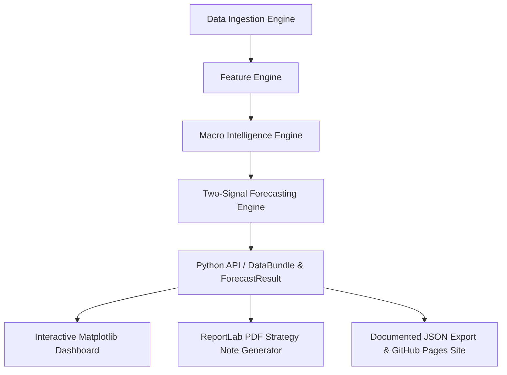

# Macro Intelligence Platform

[](LICENSE)
[](https://www.python.org/downloads/)
[](https://github.com/VIJNESH200/macro_intelligence_platform/actions/workflows/ci.yml)
[](https://github.com/VIJNESH200/macro_intelligence_platform)
[](https://github.com/VIJNESH200/macro_intelligence_platform)

An academically-validated, open-source **quantitative business cycle forecasting engine** and interactive macroeconomic intelligence dashboard. It traces economic phase shifts across 4 classical regimes (*Expansion, Slowdown, Contraction, Recovery*) and projects 3M/6M/9M forward trajectories using a 3-signal consensus framework.


---

## 📌 Table of Contents
- [🌟 Highlights](#-highlights)
- [📊 Backtest & Empirical Validation](#-backtest--empirical-validation)
- [🏛️ System Architecture](#️-system-architecture)
- [🚀 Quick Start](#-quick-start)
- [🌐 Open Data Pipeline](#-open-data-pipeline)
- [📄 Automated Strategy Note Export](#-automated-strategy-note-export)
- [🤝 Contributing & License](#-contributing--license)

---

## 🌟 Highlights

- **4-Phase Business Cycle Tracing**: Maps macro health ($X$) and momentum ($Y$) using rolling Z-score transformations of Composite Leading Indicators (OECD CLI) and economic drivers.
- **Two-Signal Consensus Forecasting**: Eliminates single-model bias by blending orthogonal signals calibrated via out-of-sample backtesting:
  1. **CLI Momentum Extrapolation** (55% weight — exponential decay pull toward long-term trend)
  2. **Multivariate Historical Analogues** (45% weight — Euclidean distance matching across past cycle footprints)
  3. **Auxiliary Macro Driver Assessment** (Diagnostic macro-tilt evaluation covering Real Policy Rate, Core Industries, CPI, and Yield Spreads)
- **100% Open Data & Provider Provenance**: Fully automated pipeline using public sources (FRED, DPIIT, IMF SDMX, Yahoo Finance, RBI) with explicit `ProviderMeta` tracking (`live`, `cache`, `bundled_fallback`, `schema_ok`).
- **Python API & Notebook Integration**: Clean 3-step programmatic interface (`from macro_intel import load_macro_data, compute_features, forecast_cycle`) with typed `DataBundle` and `ForecastResult` containers.
- **Documented JSON Output & Live Dashboard**: Automated serialization to JSON Schema draft-07 contract (`docs/latest_forecast.json`), static site generation (`docs/index.html`), and append-only live track record ledger (`docs/live_track_record.csv`).
- **Automated Institutional Strategy Notes**: Exports publication-ready PDF research briefs featuring Markov transition matrices, scenario distributions (Bull/Base/Bear), and narrative synthesis.

---

## 📊 Backtest & Empirical Validation

Evaluated across a rolling **229-month out-of-sample historical window** (Jan 2007 – Present):

| Model / Baseline | Full Window 6M Quadrant Accuracy (2007–2026) | Held-Out 6M Quadrant Accuracy (2019–2026) | Health (X) MAE | Momentum (Y) MAE | Distance MAE |
| :--- | :---: | :---: | :---: | :---: | :---: |
| **Persistence Baseline** | 47.6% | 49.4% | 0.943 | 0.963 | 1.471 |
| **CLI Momentum Only** | 67.7% | 63.5% | 0.674 | 0.802 | 1.133 |
| **Historical Analogues Only** | 63.3% | **70.6%** 🏆 | 0.598 | 0.753 | 1.053 |
| **Macro Drivers Only** | 65.9% | 50.6% | 0.664 | 0.661 | 1.013 |
| **Transition Matrix Only** | 47.2% | 49.4% | N/A | N/A | N/A |
| **Two-Signal Consensus (55% Mom / 45% Ana)** | **71.2%** 🏆 | 68.2% | **0.555** 🏆 | **0.594** 🏆 | **0.877** 🏆 |

### 📈 Statistical Significance & Conviction Calibration

- **McNemar's Test (Classification Accuracy)**: $\chi^2 = 29.26, \quad p = 6.33 \times 10^{-8} \quad (p < 0.01)$ — Outperformance over Persistence is highly statistically significant.
- **Diebold–Mariano Test (Continuous Error)**: $DM = 5.07, \quad p = 3.94 \times 10^{-7} \quad (p < 0.01)$ — Reduction in Distance MAE is highly statistically significant.
- **High-Conviction Accuracy**: Signals with $\ge 58\%$ conviction score achieve **89.8% realized quadrant accuracy** ($N=98$, 95% Wilson CI: $[82.2\%, 94.4\%]$).

---

## 🏛️ System Architecture

The platform follows a clean, decoupled 5-layer architecture:


```mermaid
flowchart TD
    A[Data Ingestion Engine] --> B[Feature Engine]
    B --> C[Macro Intelligence Engine]
    C --> D[Two-Signal Forecasting Engine]
    D --> E[Python API / DataBundle & ForecastResult]
    E --> F[Interactive Matplotlib Dashboard]
    E --> G[ReportLab PDF Strategy Note Generator]
    E --> H[Documented JSON Export & GitHub Pages Site]
```

| Layer | Directory | Responsibilities |
| :--- | :--- | :--- |
| **Data Engine** | `data/` | Live provider fetching (FRED, DPIIT, IMF, Yahoo Finance, RBI) + `ProviderMeta` provenance tracking & local caching. |
| **Feature Engine** | `features/` | Vectorized Z-score transformations, velocity ($d^2/dt^2$), B-spline interpolation. |
| **Analytics** | `analytics/` | Quantitative models (`MacroIntelligenceEngine`, `ForecastingEngine`, Markov `TransitionMatrix`). |
| **API & Models** | `api.py`, `macro_intel.py`, `models.py` | Typed `DataBundle` / `ForecastResult` dataclasses and `macro_intel` import interface. |
| **Research** | `research/` | Institutional strategy narrative synthesis and publication-ready ReportLab PDF report generator. |
| **User Interface** | `ui/` | Interactive dashboard with playback controls, sparklines, and market context panels. |

---

## 🚀 Quick Start

### 1. Prerequisites
- Python 3.10+
- Git

### 2. Installation
```bash
git clone https://github.com/VIJNESH200/macro_intelligence_platform.git
cd macro_intelligence_platform
pip install -e .
```

### 3. Python API Usage
```python
from macro_intel import load_macro_data, compute_features, forecast_cycle

# 1. Load data bundle with provenance metadata
bundle = load_macro_data(offline=True)

# 2. Compute 2D cycle metrics (X Health, Y Momentum)
bundle = compute_features(bundle)

# 3. Project business cycle forward
result = forecast_cycle(bundle)
print(f"Current Regime: {result.current_regime}")
print(f"6M Projection: {result.forecasts['6m'].quadrant} (Conviction: {result.forecasts['6m'].conviction}%)")
```

See [notebooks/quickstart.ipynb](notebooks/quickstart.ipynb) for a interactive walkthrough notebook.

### 4. Launching the GUI App

**Windows Launcher:**
Double-click `run_platform.bat` or run:
```cmd
run_platform.bat
```

**Cross-Platform Command Line:**
```bash
python main.py
```

### 5. Running Validation Benchmarks & Tests
To run the full out-of-sample backtest suite and unit tests:
```bash
python -m unittest discover -s tests
python tests/backtest_benchmarks.py
```

---

## 🌐 Open Data Pipeline

Unlike proprietary macro engines, this platform operates on 100% open public datasets:

- **OECD India CLI**: Sourced directly from FRED (`INDLOLITOAASTSAM`).
- **Index of Eight Core Industries (ICI)**: Sourced live from the official DPIIT portal (`eaindustry.nic.in`), chain-linked across base years (2011-12 and 2022-23).
- **Consumer Price Index (CPI)**: Sourced via IMF SDMX (`IND.CPI._T.IX.M`) & official government statistics.
- **Yield Curve & Real Rates**: 10Y India Government Bond Yield vs. 91D T-Bill Rate and RBI Policy Repo Rate.
- **Market Context**: Live Yahoo Finance indices (Nifty 50, Sensex, Nifty Bank, S&P 500, Nasdaq 100, Brent Crude, USD/INR, VIX).

### Market Selector (India / US)

The **India** / **US** buttons in the lower-right corner switch the entire dashboard — primary indicator, macro drivers, and market context panel — between the two market profiles defined in `config/markets.py`. Each market has its own indicator ticker, macro-driver set, and market-context series (e.g. India tracks Sensex/Nifty, US tracks Dow Jones/Russell 2000), so switching markets reloads and recomputes the full pipeline rather than just relabeling the existing chart.

---

## 📄 Automated Strategy Note Export

Clicking the **"Export PDF"** button in the dashboard generates a publication-ready macroeconomic brief in `exports/`:

| Page 1: Executive Summary & Thesis | Page 2: Cycle Position & Dashboard |
| :---: | :---: |
|  |  |

- **Executive Summary & Strategy Cards**: Stance classification (*Highly Constructive, Constructive, Cautious, Defensive, Highly Defensive*).
- **Markov Transition Probabilities**: Empirical 4×4 regime transition probabilities and expected phase durations.
- **Scenario Horizon Matrix**: 3M/6M/9M Bull, Base, and Bear probabilistic paths with expected asset returns.
- **Methodology Appendix**: Formal mathematical definitions for Z-scores, Euclidean analogue matching, and conviction scoring.

---

## 🤝 Contributing & License

Contributions are welcome! Please submit Pull Requests or open an Issue for feature suggestions.

This project is open-source under the [MIT License](LICENSE).

---

## 📄 Citation

If you use this platform in academic research or quantitative modeling, please cite it using:

```bibtex
@software{vijnesh_macro_intelligence_2026,
  author = {Vijnesh},
  title = {Macro Intelligence Platform: Quantitative Business Cycle Forecasting Engine},
  url = {https://github.com/VIJNESH200/macro_intelligence_platform},
  year = {2026}
}
```
