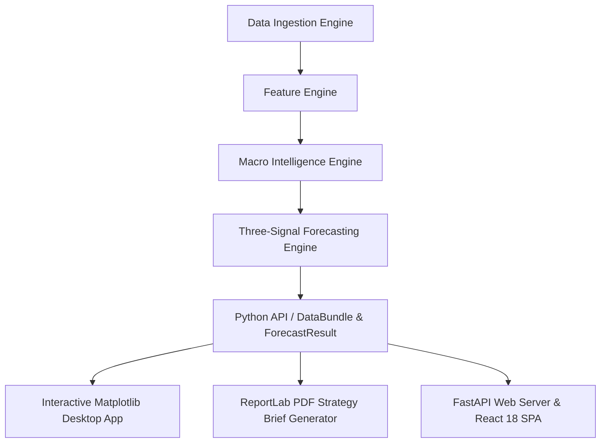

# Macro Intelligence Platform

[](LICENSE)
[](https://www.python.org/downloads/)
[](https://github.com/VIJNESH200/macro_intelligence_platform/actions/workflows/ci.yml)
[](https://macro-intelligence-platform-three.vercel.app/)
[](https://github.com/VIJNESH200/macro_intelligence_platform)
[](https://github.com/VIJNESH200/macro_intelligence_platform)

> **A live web platform for tracking business cycles, forecasting macroeconomic turning points, and generating institutional strategy reports.**  
> 🌐 **Live Web App**: [https://macro-intelligence-platform-three.vercel.app/](https://macro-intelligence-platform-three.vercel.app/)

An open-source, quantitative business cycle forecasting platform. It traces economic phase shifts across 4 classical regimes (*Expansion, Slowdown, Contraction, Recovery*) and projects 3M/6M/9M forward trajectories using a 3-signal consensus framework.


---

## 📌 Table of Contents
- [🌟 Highlights](#-highlights)
- [📄 One-Click Institutional PDF Reports](#-one-click-institutional-pdf-reports)
- [🌐 Live Web App & Cloud Architecture](#-live-web-app--cloud-architecture)
- [📊 Backtest & Empirical Validation](#-backtest--empirical-validation)
- [🏛️ System Architecture](#️-system-architecture)
- [🚀 Quick Start & Local Development](#-quick-start--local-development)
- [🌐 Open Data Pipeline & Provider Engine](#-open-data-pipeline--provider-engine)
- [🔮 Roadmap](#-roadmap)
- [📚 Developer Documentation](#-developer-documentation)
- [🤝 Contributing & License](#-contributing--license)

---

## 🌟 Highlights

- **4-Phase Business Cycle Tracing**: Maps macro health ($X$) and momentum ($Y$) using rolling Z-score transformations of Composite Leading Indicators (OECD CLI) and economic drivers.
- **Three-Signal Consensus Forecasting**: Eliminates single-model bias by blending orthogonal signals calibrated via out-of-sample backtesting:
  1. **CLI Momentum Extrapolation** (40% weight — exponential decay pull toward long-term trend)
  2. **Multivariate Historical Analogues** (35% weight — Euclidean distance matching across past cycle footprints)
  3. **Auxiliary Macro Driver Assessment** (25% weight — walk-forward Ridge regression covering Real Policy Rate, Core Industries, CPI, and Yield Spreads)
- **Interactive Timeline Scrubbing**: Smooth SVG chart rendering and payload caching ensure lockstep synchronization between historical dot trajectory and forward projection fan.
- **Decoupled React SPA & FastAPI Cloud Architecture**: High-performance React 18 / TypeScript frontend hosted on **Vercel CDN** paired with a scalable **FastAPI** backend on **Render**.
- **100% Open Data & Provider Provenance**: Fully automated pipeline using public sources (FRED, DPIIT, IMF SDMX, Yahoo Finance, RBI) with explicit `ProviderMeta` tracking (`live`, `cache`, `bundled_fallback`, `schema_ok`).
- **Python API & Notebook Integration**: Programmatic interface (`from macro_intel import load_macro_data, compute_features, forecast_cycle`) with typed `DataBundle` and `ForecastResult` containers.

---

## 📄 One-Click Institutional PDF Reports

Publication-quality macroeconomic strategy reports modelled on Goldman Sachs, JPMorgan, and BlackRock institutional research. Generated instantly from live analytics — no manual formatting required.

### How to Generate

- 🌐 **Live Web App**: Click the **"Report"** button in the top navigation bar at [macro-intelligence-platform-three.vercel.app](https://macro-intelligence-platform-three.vercel.app/). The PDF streams directly to your browser.
- 💻 **Desktop App**: Click **"Export PDF"** in the Matplotlib GUI, or run `python -m research.pdf` to generate locally in `exports/`.
- 🔗 **API**: `GET /api/report?market=INDIA&idx=latest` returns the PDF as a file download.

### Report Contents (7 Pages)

| Page | Section | Contents |
|:----:|---------|----------|
| **1** | **Cover & Executive Summary** | Report header with small-caps branding, metadata table, executive snapshot callout box (Current Regime, Macro Score, Confidence, Primary Risk, Investment View, Next Likely Phase), key takeaways card |
| **2** | **Positioning & Dashboard** | Business cycle quadrant chart (300 DPI), 4 KPI metric cards (Macro Score, Market Score, Historical Similarity, Transition Risk), key metrics delta comparison |
| **3** | **Macro Drivers & Dynamics** | Quantitative macro driver table with signal-coloured levels, key regime developments (auto-generated from computed metrics when sparse), research insight cards, cycle timeline & transition outlook |
| **4** | **Historical Validation** | Top-5 historical analogue table with similarity scores and 6M forward returns, cross-market context with multi-horizon return heatmap |
| **5** | **Forward Projections** | 3M/6M/9M forecast table, signal contribution weights, scenario analysis (Bull/Base/Bear paths with expected returns), regime transition matrix heatmap |
| **6** | **Interpretation & Risks** | Integrated market interpretation narrative, core macro risk factors |
| **7** | **Methodology & Provenance** | Analytical methodology, data provenance table, generation metadata, QR code linking to live dashboard, disclaimer |

### Design System

All styling is centralized in [`research/pdf_styles.py`](research/pdf_styles.py) — a single source of truth for:

- **6-level typography hierarchy** (Title → Section → Subheading → Body → Caption → Footer)
- **Institutional colour palette** (Navy primary, charcoal body, monochrome signal tones)
- **Reusable table factories** (`institutional_table_style()`, `summary_row_style()`)
- **Flowable helpers** (`section_heading()`, `kpi_card()`, `thin_rule()`)
- **Consistent spacing tokens** across all pages

Every page follows the same layout grid with consistent margins, padding, and section spacing. Running footer on all pages: *Macro Intelligence Platform · Institutional Strategy Report · Page X · Generated automatically*.

---

## 🌐 Live Web App & Cloud Architecture

The platform features a production-ready, decoupled hybrid cloud deployment:

- 🌐 **Live Web App**: [https://macro-intelligence-platform-three.vercel.app/](https://macro-intelligence-platform-three.vercel.app/)

### Technology Stack & Cloud Infrastructure
- **Frontend**: React 18 + TypeScript + Vite (Tailwind CSS, D3 SVG Charting)
- **Backend**: FastAPI + Python 3.10 (Uvicorn, SciPy, NumPy, Pandas, ReportLab)
- **Cloud Hosting**: **Vercel** (Global Edge CDN SPA) + **Render** (Python API Web Service)

```
                         ┌──────────────────────────────────────────────┐
                         │       Vercel Frontend (React 18 SPA)         │
                         │  https://macro-intelligence-platform...      │
                         └──────────────────────┬───────────────────────┘
                                                │ VITE_API_BASE_URL
                                                ▼
                         ┌──────────────────────────────────────────────┐
                         │       Render Backend (FastAPI Web Service)   │
                         │  https://macro-intelligence-api.onrender.com │
                         └──────────────────────┬───────────────────────┘
                                                │
                         ┌──────────────────────┴───────────────────────┐
                         ▼                                               ▼
     ┌───────────────────────────────────────┐       ┌───────────────────────────────────────┐
     │      Quantitative Engine & Models     │       │     Open Data & Provenance Pipeline   │
     │ (Z-Score, Spline, 3-Signal Consensus) │       │   (FRED, DPIIT, IMF, Yahoo, RBI)      │
     └───────────────────────────────────────┘       └───────────────────────────────────────┘
```

---

## 📊 Backtest & Empirical Validation

Evaluated across a rolling **229-month out-of-sample historical window** (Jan 2007 – Present). *Note: 6M is used as the primary evaluation horizon for backtest validation; 3M and 9M trajectories are projected dynamically using the same underlying consensus framework.*

### India 6M Horizon Backtest Benchmarks (2007–2026)
| Model / Baseline | Full Window Quadrant Accuracy | Held-Out Quadrant Accuracy (2019–2026) | Health (X) MAE | Momentum (Y) MAE | Distance MAE |
| :--- | :---: | :---: | :---: | :---: | :---: |
| **Persistence Baseline** | 47.6% | 49.4% | 0.943 | 0.963 | 1.471 |
| **CLI Momentum Only** | 67.7% | 63.5% | 0.674 | 0.802 | 1.133 |
| **Historical Analogues Only** | 63.3% | **70.6%** 🏆 | 0.598 | 0.753 | 1.053 |
| **Macro Drivers Only** | 65.9% | 50.6% | 0.664 | 0.661 | 1.013 |
| **Transition Matrix Only** | 47.2% | 49.4% | N/A | N/A | N/A |
| **Blended Consensus (40% Mom / 35% Ana / 25% Macro)** | **71.2%** 🏆 | 68.2% | **0.555** 🏆 | **0.594** 🏆 | **0.877** 🏆 |

### US 6M Horizon Backtest Benchmarks (2007–2026)
| Model / Baseline | Full Window Quadrant Accuracy | Held-Out Quadrant Accuracy (2019–2026) | Health (X) MAE | Momentum (Y) MAE | Distance MAE |
| :--- | :---: | :---: | :---: | :---: | :---: |
| **Persistence Baseline** | 38.4% | 41.2% | 0.932 | 1.071 | 1.561 |
| **CLI Momentum Only** | 51.5% | 50.6% | 0.689 | 1.183 | 1.495 |
| **Historical Analogues Only** | 55.9% | 50.6% | 0.955 | 0.980 | 1.480 |
| **Macro Drivers Only** | 55.9% | 43.5% | 0.849 | 0.873 | 1.302 |
| **Blended Consensus (40% Mom / 35% Ana / 25% Macro)** | **56.3%** 🏆 | **51.8%** 🏆 | **0.658** 🏆 | **0.873** 🏆 | **1.182** 🏆 |

### 📈 Statistical Significance & Conviction Calibration
- **McNemar's Test (Classification Accuracy)**: $\chi^2 = 29.26, \quad p = 6.33 \times 10^{-8} \quad (p < 0.01)$ — Outperformance over Persistence is highly statistically significant.
- **Diebold–Mariano Test (Continuous Error)**: $DM = 5.07, \quad p = 3.94 \times 10^{-7} \quad (p < 0.01)$ — Reduction in Distance MAE is highly statistically significant.
- **Top-Quartile Conviction Accuracy**: India top-quartile conviction signals achieve **98.2% realized quadrant accuracy** ($N=55$).

---

## 🏛️ System Architecture

The platform follows a decoupled 6-layer architecture:


```mermaid
flowchart TD
    A[Data Ingestion Engine] --> B[Feature Engine]
    B --> C[Macro Intelligence Engine]
    C --> D[Three-Signal Forecasting Engine]
    D --> E[Python API / DataBundle & ForecastResult]
    E --> F[Interactive Matplotlib Desktop App]
    E --> G[ReportLab PDF Strategy Brief Generator]
    E --> H[FastAPI Web Server & React 18 SPA]
```

| Layer | Directory / File | Responsibilities |
| :--- | :--- | :--- |
| **Data Engine** | `data/` | Live provider fetching (FRED, DPIIT, IMF, Yahoo Finance, RBI) + `ProviderMeta` provenance tracking & local caching. Includes `YieldProvider` for 10Y-91D spreads. |
| **Feature Engine** | `features/` | Vectorized Z-score transformations, calendar month YoY alignment, velocity ($d^2/dt^2$), B-spline interpolation. |
| **Analytics** | `analytics/` | Quantitative models (`MacroIntelligenceEngine`, `ForecastingEngine`, Markov `TransitionMatrix`). |
| **API & Models** | `core_api.py`, `macro_intel.py`, `models.py` | Typed `DataBundle` / `ForecastResult` dataclasses and clean `macro_intel` import interface. |
| **Research** | `research/` | Institutional strategy narrative synthesis and publication-ready ReportLab PDF report generator. |
| **Desktop App** | `ui/` | Interactive Matplotlib desktop GUI with playback controls, sparklines, and market context panels. |
| **Web Server & UI** | `web/` & `web/frontend/` | FastAPI REST API (`web/server.py`), compute composition (`web/compute.py`), and React 18 SVG frontend (`web/frontend/`). |

---

## 🚀 Quick Start & Local Development

### 1. Prerequisites
- Python 3.10+
- Node.js 18+ (for Web frontend development)
- Git

### 2. Installation
```bash
git clone https://github.com/VIJNESH200/macro_intelligence_platform.git
cd macro_intelligence_platform
pip install -e ".[all]"
```

### 3. Python API Usage
```python
from macro_intel import load_macro_data, compute_features, forecast_cycle

# 1. Load data bundle with provenance metadata ("INDIA" or "US")
bundle = load_macro_data(market="INDIA", offline=True)

# 2. Compute 2D cycle metrics (X Health, Y Momentum)
bundle = compute_features(bundle)

# 3. Project business cycle forward
result = forecast_cycle(bundle)
print(f"Current Regime: {result.current_regime}")
print(f"6M Projection: {result.forecasts['6m'].quadrant} (Conviction: {result.forecasts['6m'].conviction}%)")
```

See [notebooks/quickstart.ipynb](notebooks/quickstart.ipynb) for an interactive walkthrough notebook.

### 4. Running the Desktop Matplotlib App
```bash
python main.py
```

### 5. Running the Web App Locally
```bash
# Terminal 1: Launch FastAPI Backend (Port 8000)
python -m uvicorn web.server:app --reload --port 8000

# Terminal 2: Launch Vite React Frontend (Port 5173)
cd web/frontend
npm install
npm run dev
```
Open `http://localhost:5173/` in your browser.

### 6. Running Validation Benchmarks & Tests
```bash
pytest tests/
python tests/backtest_benchmarks.py
```

---

## 🌐 Open Data Pipeline & Provider Engine

Unlike proprietary macro engines, this platform operates on 100% open public datasets:

- **OECD India CLI**: Sourced directly from FRED (`INDLOLITOAASTSAM`).
- **OECD US CLI**: Sourced directly from FRED (`USALOLITOAASTSAM`).
- **Index of Eight Core Industries (ICI)**: Sourced live from the official DPIIT portal (`eaindustry.nic.in`), chain-linked across base years (2011-12 and 2022-23) with `openpyxl` support.
- **Consumer Price Index (CPI)**: Sourced via IMF SDMX (`IND.CPI._T.IX.M`) & FRED (`CPIAUCSL`).
- **Yield Curve & Real Rates**: `YieldProvider` calculating 10Y India Government Bond Yield vs. 91D T-Bill Rate and RBI Policy Repo Rate; US 10Y vs 3M Treasury spread (`T10Y3M`).
- **Market Context**: Live Yahoo Finance indices (Nifty 50, Sensex, Nifty Bank, S&P 500, Nasdaq 100, Dow Jones, Russell 2000, Brent Crude, WTI, USD/INR, Dollar Index, VIX).

---

## 🔮 Roadmap

- [ ] **Relative Rotation Graphs (RRG)**: Sector-rotation matrix and asset momentum rotation.
- [ ] **Additional International Markets**: Expanding beyond US & India to Eurozone, Japan, and UK profiles.
- [ ] **Portfolio Allocation Overlays**: Regime-conditioned asset allocation weights and risk parity triggers.
- [ ] **Economic Event Calendar**: High-frequency macroeconomic event schedules and release tracking.
- [ ] **Ensemble Forecasting Expansion**: Incorporating non-linear machine learning models into the auxiliary driver consensus.

---

## 📚 Developer Documentation

For deep architectural details, test infrastructure, and project execution context:

- 📖 **[Methodology & Specifications](METHODOLOGY.md)**: Mathematical definitions for Z-scores, velocity, analogues, and conviction scoring.
- 🏗️ **[Developer Briefing & Architecture](docs/dev/BRIEFING.md)**: Codebase layout, layer contracts, and module specs.
- 🧪 **[Test & Validation Infrastructure](docs/dev/TEST_INFRA.md)**: Out-of-sample backtesting methodology and benchmark quality gates.
- 📋 **[Project Roadmap & History](docs/dev/PROJECT.md)**: Architectural phase progression and feature history.

---

## 🤝 Contributing & License

Contributions are welcome! Please submit Pull Requests or open an Issue for feature suggestions.

This project is open-source under the [MIT License](LICENSE).

---

## 📄 Citation

If you use this platform in academic research or quantitative modeling, please cite it using:

```bibtex
@software{vijnesh_macro_intelligence_2026,
  author = {Vijnesh},
  title = {Macro Intelligence Platform: Quantitative Business Cycle Forecasting Engine},
  url = {https://github.com/VIJNESH200/macro_intelligence_platform},
  year = {2026}
}
```
